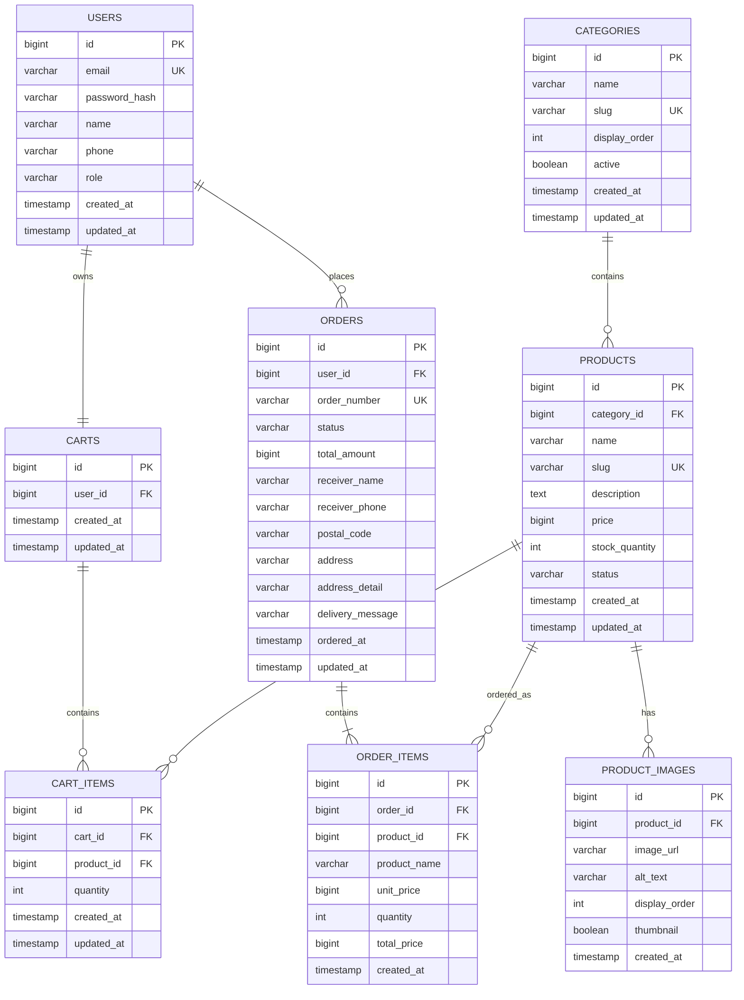

# Plavor ERD

이 문서는 Plavor 쇼핑몰의 공식 ERD 초안입니다. ERD는 Mermaid로 작성해서 GitHub Markdown에서 바로 렌더링되도록 관리합니다.

## MVP Scope

1차 MVP는 아래 기능을 기준으로 설계합니다.

- 상품 목록
- 상품 상세
- 장바구니
- 회원가입/로그인
- 주문 생성
- 관리자 상품 등록/수정/숨김

결제, 리뷰, 쿠폰, 포인트, 배송 추적, 상품 옵션은 1차 MVP 이후에 확장합니다.

## ERD

## Table Notes

### users

회원 계정입니다. `role`은 일반 사용자와 관리자를 구분합니다.

- `USER`: 일반 회원
- `ADMIN`: 관리자

비밀번호는 원문이 아니라 해시값만 저장합니다.

### categories

상품 카테고리입니다. URL에 사용할 수 있는 `slug`를 별도로 둡니다.

### products

상품의 기본 정보입니다. 1차 MVP에서는 색상/사이즈 옵션 없이 상품 단위 재고만 관리합니다.

`status` 후보:

- `ACTIVE`: 판매 중
- `SOLD_OUT`: 품절
- `HIDDEN`: 비공개

### product_images

상품 이미지는 URL 문자열로 시작합니다. 실제 파일 업로드나 S3 같은 외부 스토리지는 이후 단계에서 붙입니다.

### carts / cart_items

회원별 장바구니입니다. 1차 MVP는 비회원 장바구니를 제외합니다.

### orders / order_items

주문 생성 시점의 배송지와 상품 정보를 스냅샷으로 저장합니다.

특히 `order_items.product_name`, `order_items.unit_price`는 상품명이 바뀌거나 가격이 바뀌어도 과거 주문 내역이 변하지 않도록 저장합니다.

## Implementation Plan

ERD 반영 순서는 아래처럼 진행합니다.

1. Flyway 추가
2. `V1__create_mvp_schema.sql` 작성
3. JPA Entity 작성
4. Repository/Service/Controller 작성
5. `GET /api/products`, `GET /api/products/{id}` 구현
6. React 상품 목록/상세 화면 연결

운영 환경은 `ddl-auto: validate`를 사용하므로, 테이블 변경은 Hibernate 자동 생성이 아니라 Flyway migration으로 반영합니다.
